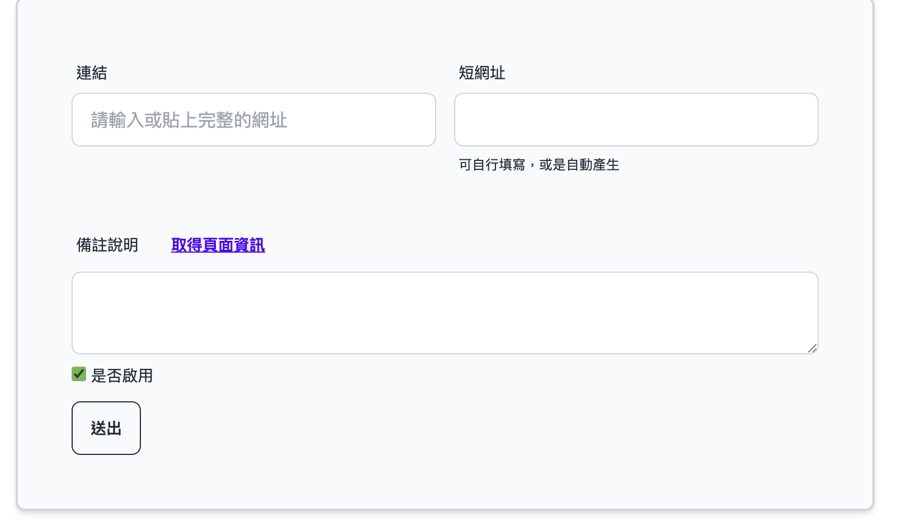
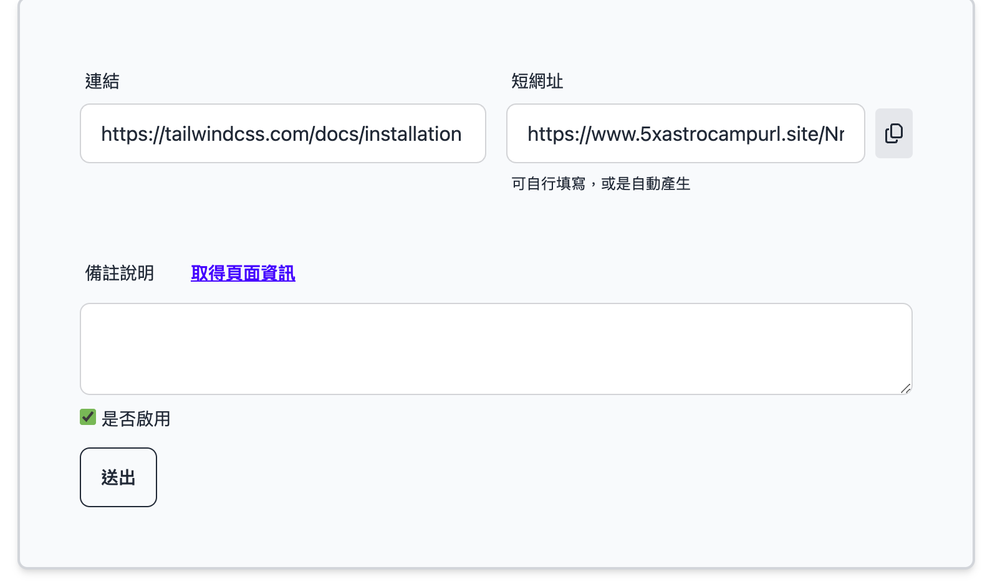
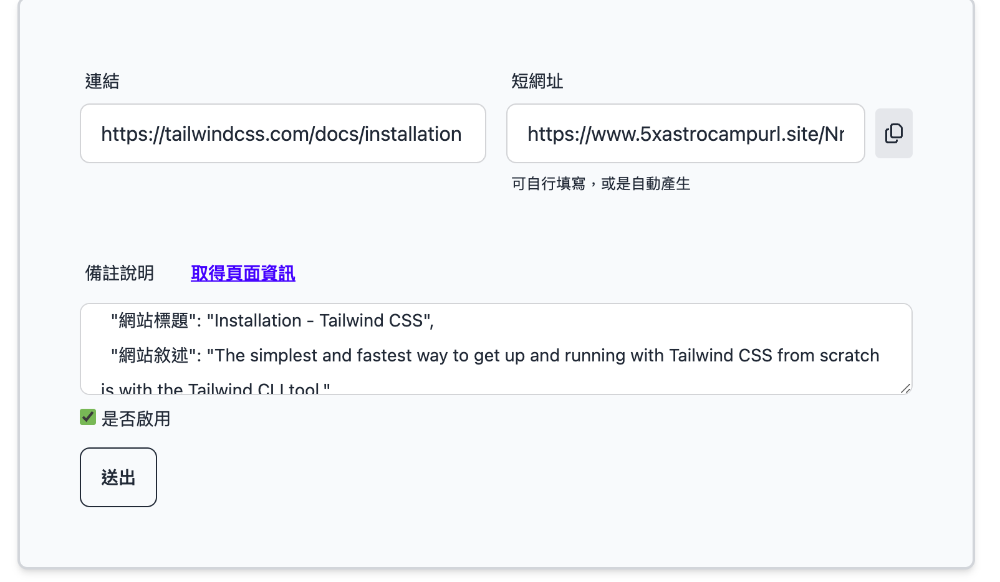

<h1 align="center">
  短網址生產器 url-shortener
</h1>

## 專案介紹

這是一個短網址生產器，能迅速將冗長的網址轉換為簡潔的短連結，不僅增強了可讀性，還便於分享和使用。

用戶只需貼上原網址，系統便會生成專屬短網址，並支援一鍵複製，操作簡單且方便。

此外，網站還提供原網址資訊的查看功能，用戶能夠輕鬆取得原始連結的基本資料（例如標題和描述）等內容。

趕快來試試看吧！

專案網址：[https://www.5xastrocampurl.site/](https://www.5xastrocampurl.site/)(已停用)

## 功能介紹

1. **生產短網址：**

- 將網址貼上，選擇是否啟用短網址，按下「送出」即可生成專屬短連結。
- 點擊短網址旁的，一鍵複製短網址，輕鬆分享！

2. **取得頁面資訊：**

- 短網址生成後，點擊「取得頁面資訊」，即可查看原始網址的標題及描述，方便了解網址內容。

## 安裝環境

1. `git clone https://github.com/KK-Huang86/url-shortener.git`(將專案複製到本地)
2. `cd url-shortener`(進入專案目錄)
3. `poetry shell` (進入 Poetry 環境)
4. `poetry install`(安裝 Poetry 相關套件)
5. `npm install`(安裝 npm 相關套件)
6. 建立`.env`(設定環境變數)

## 執行環境

1. `npm run dev`
2. `python manage.py runserver`

## 技術使用

- **前端**：daisyUI, TailwindCSS, Alpine.js（透過 esbuild 打包管理）
- **後端**：Python, Django
- **資料庫**：SQLite
- **版本控制**：Git
- **部署**：AWS EC2（Gunicorn 處理應用邏輯和請求、Nginx 反向代理）

## 未來優化

1. 支援手機尺寸，讓行動裝置用戶也能輕鬆使用
2. 加入短網址停用後再次啟用功能
3. 將頁面資訊查詢功能改由後端處理
4. 支援自訂短網址名稱功能
5. 修改 UI 設計
